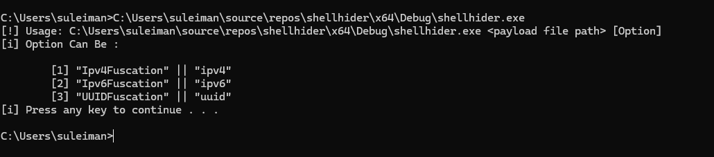
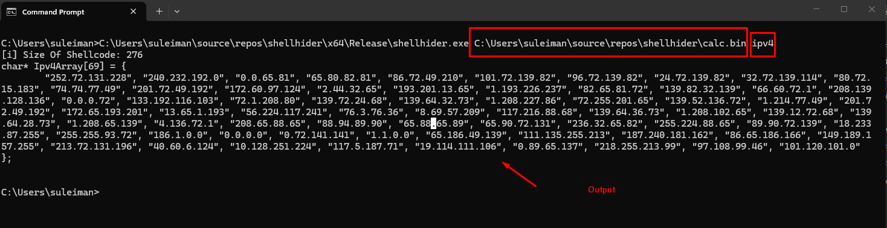
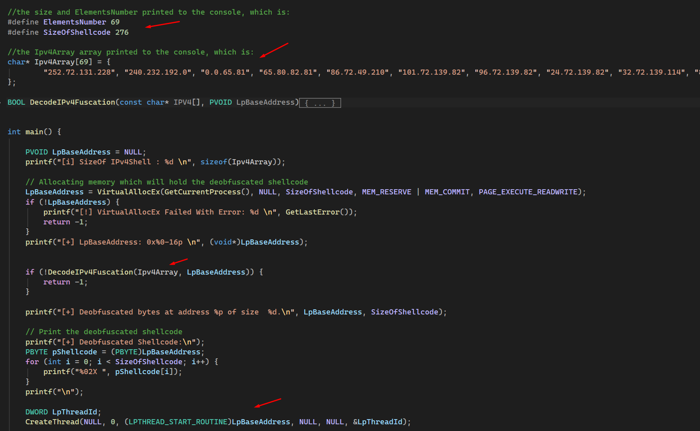
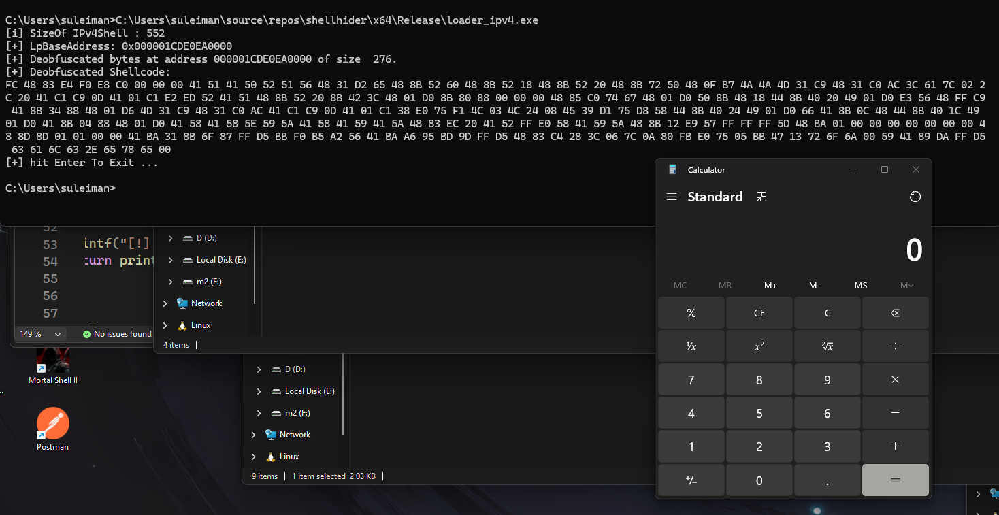

# Shellcode Obfuscation Tool

Das Tool liest Shellcode aus einer `.bin`-Datei und wandelt ihn
in IPv4-, IPv6- oder UUID-Darstellungen um.

## Unterstützte Formate

- IPv4Fuscation
- IPv6Fuscation
- UUIDFuscation

## Screenshots

## Demo

In unserer Demo führen wir `calc.bin` lokal mit `VirtualAlloc` und `CreateThread` aus. Dieses Ausführungsmuster ist Sicherheitsprodukten bekannt. Die Obfuskation verändert die Darstellung des Shellcodes, garantiert aber keine Umgehung der Erkennung.

Für lokale Ausführung ist normalerweise `VirtualAlloc` mit `CreateThread` gemeint. `VirtualAllocEx` reserviert Speicher in einem angegebenen Prozess; CreateThread startet einen Thread im eigenen Prozess.

## Output

